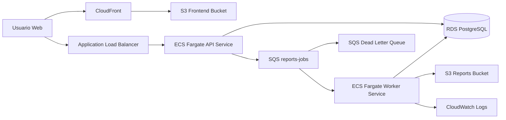

# TECHNICAL_DOCS.md

## Objetivo

Sistema asincrono de generacion de reportes para una plataforma SaaS. La API crea jobs, un worker los procesa fuera de linea y el frontend muestra el estado en tiempo real.

## Arquitectura objetivo



## Servicios AWS recomendados

| Servicio | Uso en el sistema | Motivo |
|---|---|---|
| Amazon SQS Standard | Cola principal de jobs | Desacopla API y worker con reintentos y DLQ |
| Amazon SQS DLQ | Mensajes fallidos | Evita que jobs defectuosos bloqueen el flujo |
| Amazon RDS PostgreSQL | Persistencia principal | SQL, indices por usuario, transacciones, simplicidad operativa |
| Amazon ECS Fargate | API y worker | Contenedores sin administrar EC2 |
| Amazon ECR | Registro de imagenes | Integracion directa con ECS |
| Amazon S3 | Reportes generados y frontend estatico | Simple, barato y adecuado para archivos |
| Amazon CloudFront | CDN y entrega publica del frontend | HTTPS, cache y SPA publica |
| Amazon CloudWatch Logs | Logs centralizados | Visibilidad operativa y debugging |

## Trade-offs

### SQS sobre SNS o EventBridge

- SQS resuelve mejor una cola de trabajo con consumo controlado.
- SNS se ajusta mejor a fan-out.
- EventBridge agrega flexibilidad, pero es mas complejo para esta prueba.

### RDS PostgreSQL sobre DynamoDB

- El acceso principal es por usuario y fecha, con paginacion y filtros simples.
- PostgreSQL simplifica autenticacion local, queries y consistencia.
- DynamoDB es valido, pero obliga a modelar mas cuidadosamente claves y paginacion.

### ECS Fargate sobre Lambda

- El worker necesita polling, concurrencia controlada y trazabilidad simple.
- Lambda seria viable, pero agrega mas piezas y limites operativos para esta prueba.

## Esquema inicial de base de datos

```sql
CREATE EXTENSION IF NOT EXISTS "pgcrypto";

DO $$
BEGIN
    IF NOT EXISTS (SELECT 1 FROM pg_type WHERE typname = 'job_status') THEN
        CREATE TYPE job_status AS ENUM ('PENDING', 'PROCESSING', 'COMPLETED', 'FAILED');
    END IF;
END $$;

CREATE TABLE IF NOT EXISTS users (
    id UUID PRIMARY KEY DEFAULT gen_random_uuid(),
    email VARCHAR(255) NOT NULL UNIQUE,
    password_hash TEXT NOT NULL,
    created_at TIMESTAMPTZ NOT NULL DEFAULT NOW()
);

CREATE TABLE IF NOT EXISTS jobs (
    job_id UUID PRIMARY KEY DEFAULT gen_random_uuid(),
    user_id UUID NOT NULL REFERENCES users(id) ON DELETE CASCADE,
    status job_status NOT NULL DEFAULT 'PENDING',
    report_type VARCHAR(100) NOT NULL,
    report_format VARCHAR(20) NOT NULL,
    date_from DATE NOT NULL,
    date_to DATE NOT NULL,
    created_at TIMESTAMPTZ NOT NULL DEFAULT NOW(),
    updated_at TIMESTAMPTZ NOT NULL DEFAULT NOW(),
    result_url TEXT NULL,
    error_message TEXT NULL,
    attempt_count INTEGER NOT NULL DEFAULT 0,
    last_error_at TIMESTAMPTZ NULL
);

CREATE INDEX IF NOT EXISTS idx_jobs_user_created_at
    ON jobs (user_id, created_at DESC);

CREATE INDEX IF NOT EXISTS idx_jobs_user_status_created_at
    ON jobs (user_id, status, created_at DESC);

CREATE INDEX IF NOT EXISTS idx_jobs_status_created_at
    ON jobs (status, created_at ASC);
```

## Diseno del worker

Flujo esperado:

1. La API crea el job con estado `PENDING`.
2. La API publica un mensaje SQS con `job_id`.
3. El worker consume lotes de hasta 10 mensajes.
4. El worker procesa al menos 2 mensajes en paralelo.
5. Antes de ejecutar, hace claim atomico del job si sigue en `PENDING`.
6. Si procesa correctamente, sube resultado a S3 y marca `COMPLETED`.
7. Si falla, no elimina el mensaje; SQS reintenta.
8. Si el mensaje supera el maximo de reintentos, va a la DLQ.

## Setup local objetivo

En local:

- `docker compose up` levantara FastAPI, worker, frontend, PostgreSQL y LocalStack
- LocalStack emulara SQS y S3
- PostgreSQL local reemplazara RDS
- API y worker correran en contenedores separados

## Variables esperadas

Estas variables se definiran luego en `.env.example`:

- `APP_ENV`
- `DATABASE_URL`
- `AWS_REGION`
- `AWS_ENDPOINT_URL`
- `AWS_ACCESS_KEY_ID`
- `AWS_SECRET_ACCESS_KEY`
- `SQS_QUEUE_URL`
- `SQS_DLQ_URL`
- `S3_REPORTS_BUCKET`
- `JWT_SECRET_KEY`
- `JWT_ALGORITHM`
- `JWT_EXPIRE_MINUTES`

## Variables documentadas en `.env.example`

| Variable | Uso |
|---|---|
| `APP_ENV` | entorno de ejecucion |
| `APP_VERSION` | version expuesta en health |
| `API_PORT` | puerto local de la API |
| `FRONTEND_PORT` | puerto local del frontend |
| `DATABASE_URL` | DSN completa para entorno local o alternativo |
| `DB_HOST` | host de PostgreSQL en produccion |
| `DB_PORT` | puerto de PostgreSQL |
| `DB_NAME` | nombre de base de datos |
| `DB_USER` | usuario de base de datos |
| `DB_PASSWORD` | password de base de datos |
| `AWS_REGION` | region AWS |
| `AWS_ENDPOINT_URL` | endpoint LocalStack en local |
| `AWS_ACCESS_KEY_ID` | credencial AWS local o runner |
| `AWS_SECRET_ACCESS_KEY` | credencial AWS local o runner |
| `SQS_QUEUE_URL` | cola principal |
| `SQS_DLQ_URL` | cola de dead-letter |
| `S3_REPORTS_BUCKET` | bucket de reportes |
| `JWT_SECRET_KEY` | secreto para firmar JWT |
| `JWT_ALGORITHM` | algoritmo JWT |
| `JWT_EXPIRE_MINUTES` | expiracion del token |
| `CORS_ORIGINS` | orígenes permitidos por CORS |
| `WORKER_CONCURRENCY` | concurrencia local del worker |
| `WORKER_POLL_SECONDS` | long polling sobre SQS |
| `WORKER_MAX_RECEIVE_COUNT` | umbral operativo para marcar fallo final |
| `WORKER_SLEEP_MIN_SECONDS` | minimo del procesamiento simulado |
| `WORKER_SLEEP_MAX_SECONDS` | maximo del procesamiento simulado |

## Smoke test manual

Se incluye `local/smoke-test.ps1` para validar rapidamente:

- frontend accesible
- API accesible
- payload de `GET /health`

## Setup local implementado

El proyecto ya incluye:

- `docker-compose.yml` en la raiz
- PostgreSQL con inicializacion automatica desde `local/postgres/init.sql`
- LocalStack con bootstrap automatico desde `local/aws/init-aws.sh`
- contenedor `api` con FastAPI
- contenedor `worker` con consumo concurrente de SQS
- contenedor `frontend` con Vite

## Endpoints implementados en Fase 2

- `POST /api/auth/register`
- `POST /api/auth/login`
- `POST /api/jobs`
- `GET /api/jobs/{job_id}`
- `GET /api/jobs`
- `GET /health`

## Manejo de errores

La API ya usa handlers globales para:

- errores de aplicacion
- errores de validacion Pydantic/FastAPI
- errores inesperados

## Fase 3

Cambios incorporados:

- `POST /api/jobs` responde con contrato de aceptacion: `job_id` y `status`
- `GET /health` ahora revisa PostgreSQL, SQS y S3
- suite inicial de tests para health, endpoint de jobs y flujo principal del worker

## Fase 4

Cambios incorporados:

- Terraform en `infra/` para provisionar la topologia de AWS real
- pipeline de GitHub Actions en `.github/workflows/ci-cd.yml`
- guia de outputs Terraform a GitHub Secrets

## Fase 5

Cambios incorporados:

- logging estructurado JSON para API y worker
- request correlation con `x-request-id`
- `GET /health` expone `service`, `version` y `environment`
- RDS se mueve a subnets privadas
- ECS deja de inyectar `DB_PASSWORD` y `JWT_SECRET_KEY` inline; ahora usa SSM Parameter Store

## Recursos creados por Terraform

- VPC con 2 subnets publicas
- ALB publico para la API
- ECS Cluster con dos servicios Fargate
- ECR para `api` y `worker`
- RDS PostgreSQL `db.t3.micro`
- SQS principal y DLQ
- bucket S3 privado para reportes
- bucket S3 privado + CloudFront para frontend
- grupos de logs en CloudWatch

## Trade-off de IaC en esta fase

La VPC es deliberadamente simple y usa solo subnets publicas. Para un entorno productivo mas estricto, el siguiente endurecimiento seria:

- subnets privadas para ECS ademas de RDS
- NAT Gateway
- secrets en Secrets Manager o SSM Parameter Store en vez de variables inline de task definition
- HTTPS custom con ACM + Route53

## Pipeline de GitHub Actions

El workflow tiene dos jobs:

- `test-and-build`: valida backend y frontend en cualquier PR o push
- `deploy`: solo corre en `main` y publica artefactos en AWS

## Secrets requeridos en GitHub

- `AWS_ACCESS_KEY_ID`
- `AWS_SECRET_ACCESS_KEY`
- `AWS_REGION`
- `API_ECR_REPOSITORY`
- `WORKER_ECR_REPOSITORY`
- `FRONTEND_BUCKET_NAME`
- `CLOUDFRONT_DISTRIBUTION_ID`
- `ECS_CLUSTER_NAME`
- `ECS_API_SERVICE_NAME`
- `ECS_WORKER_SERVICE_NAME`
- `PROD_API_BASE_URL`

## Estado del documento

Este archivo ya cubre Fase 1 y la base local de Fase 2. Falta ampliar despliegue productivo, pipeline y tests.
